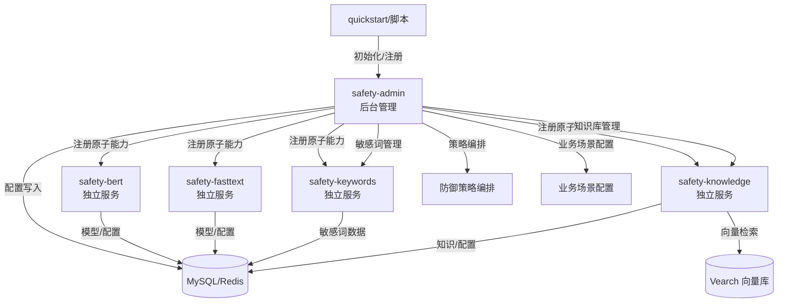
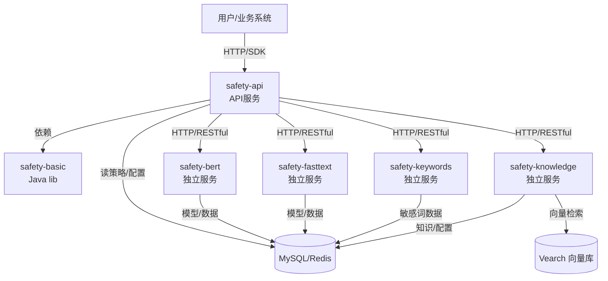

# JoySafety —— 大模型安全框架

---

## 📋 目录
- [项目简介](#项目简介)
- [✨ 特性](#特性)
- [🚀 快速开始](#快速开始)
- [📖 使用指南](#使用指南)
- [🏆 最佳实践](#最佳实践)
- [🏗️ 架构设计](#架构设计)
- [🛠️ 开发](#开发)
- [📄 许可证](#许可证)
- [📅 计划](#计划)
- Star History

---
## new release
- ✅ **提示词注入检测模型全面升级**：基于红蓝军对抗机制重构训练体系，攻击识别精度与响应速度双突破；​​最新提示词注入检测模型已升级为三分类架构，可精准区分：正常请求，明确提示词注入攻击（恶意），疑似提示词注入攻击（潜在风险），模型地址：(https://huggingface.co/jdopensource/JoySafety/tree/main)
- ✅ **大模型安全评测服务对外开放**：评测集全面覆盖《生成式人工智能服务安全基本要求》规定的五大类、31 小类风险场景，深度融合多种主流提示词注入攻击手法，一键出报告。​平台地址：http://joysafety-llmsep.jd.com

---

## <a id="项目简介"></a>项目简介
随着生成式人工智能应用的广泛落地，内容安全、数据泄露、提示词攻击等风险也日益凸显。如何保障大模型输出符合法规要求、避免安全漏洞，已成为企业必须面对的关键挑战。为此，**京东正式开源大模型安全框架——JoySafety**，该框架在京东内部广泛应用，覆盖AI导购、物流客服、销售助手、医疗问诊、商家工作台、法务咨询、安全问答等场景，支持日均亿级调用、95%+攻击拦截率，致力于为企业提供一套**成熟、可靠、免费**的大模型安全防护方案。

---

## ✨ <a id="特性"></a>特性
### 🚀 生产级别

**企业级实战验证**
- ✅ 保障京东多个**生产级AI应用**安全稳定运行
- ✅ 复杂业务场景验证，持续迭代优化
- ✅ 服务部署支持**横向扩展**，满足高并发业务需求
- ✅ 业务接入零门槛，策略变更支持分钟级**热更新**

**高可靠性保障**
- 🔄 **原子能力热插拔**，业务不中断
- ⚡ **配置动态生效**，快速响应业务变化  
- 📊 **生产环境长期稳定性**验证

---

### 📈 高扩展性

**灵活的架构设计**
- 🧩 支持**多种原子能力模块**（BERT/FastText/Transformer等主流模型）
- 🔌 **标准化原子能力接口**，易于扩展新模型
- 🏗️ 支持**独立部署**或**集中部署**两种模式
- ⚙️ **轻量编排引擎**，按需灵活配置

**智能负载均衡**
- 🌐 **集群化部署**支持水平扩展
- ⚡ **异步检测机制**，提升并发处理能力
- 🎯 **窗口化检测策略**，平衡性能与准确性

---

### 💡 易用性

**开箱即用**
- 🐳 **一键Docker Compose启动**，零配置门槛
- 📱 **DAG编排**
- 🔧 **标准化API接口**，快速集成现有系统

---

### 🎯 核心技术亮点

### 突破性创新

#### 1. 大模型多轮会话智能识别

#### 2. 采用Free-Taxi异步输出模式，大幅提升检测响应， 实现用户体验与安全的完美平衡

#### 3. **多维响应策略矩阵**
- 🎯 **精准拦截** - 高风险内容即时阻断
- ⏸️ **红线代答** - 红线知识库应答
- 🔄 **智能纠偏** - 自动引导正向回答
---

## 🚀 <a id="快速开始"></a>快速开始
## 环境依赖
请确保已安装以下软件：
- git
- git-lfs   用于下载模型文件
- docker
- docker compose

### 0. 克隆项目
```shell
  #1.
  git clone https://github.com/jd-opensource/JoySafety.git
  
  #2. 进入项目路径
  cd JoySafety
  
  #3. 设置环境变量（建议复制执行，后续脚本/服务均可自动识别）
  export SAFETY_ROOT_PATH=`pwd`
  #正常为JoySafety 根路径
  echo ${SAFETY_ROOT_PATH}
```

=======
### 1. 下载模型文件（Huggingface)
- [模型说明](safety/safety-skills/model_overview.md)
- 推荐使用 [git-lfs](https://git-lfs.com) 拉取大模型文件
```shell

  #进入项目路径
  cd $SAFETY_ROOT_PATH

  #
  git lfs install

  #方案1
  git clone https://huggingface.co/jdopensource/JoySafety ${SAFETY_ROOT_PATH}/data/models

  #方案2
  #因网络问题，您也可以从[ModelScope](https://modelscope.cn/models/syf20240814/joysafety/files)下载）
  
```

### 2. 配置 .env 文件
- 【在项目根路径】 **复制** `.env.example` 或手动创建 `.env`：
```shell
   # 注：切换Shell窗口, 重新设置SAFETY_ROOT_PATH
   cd $SAFETY_ROOT_PATH
   
   cp -f .env.example .env
    
   # 测试只需修改.env文件中变量:SAFETY_MODEL_DIR，路径需与模型实际下载路径一致【绝对路径】
   SAFETY_MODEL_DIR=
```

### 3. 一键启动（Docker Compose）
```shell
   docker-compose --env-file .env up
```

### 4. API 测试

详细 API 测试案例及使用说明移步到 [quickstart/README.md](quickstart/README.md)。

请参考 quickstart 目录下的文档，获取最新的 API 测试脚本和案例说明。

---

## 📖 <a id="使用指南"></a>使用指南
### 如何接入一个业务
> 该项目可以同时支持多个业务，每个业务都可以动态增加，分钟级生效。
0. 注册原子能力（如果需要用的原子能力未注册过），可参考原子能力管理参考： [function_api.md](safety/safety-admin/docs/api/function_api.md)
1. 增加一个业务（参考[business_api.md](safety/safety-admin/docs/api/business_api.md)）
2. 为业务增加策略（参考：[dag_api.md](safety/safety-admin/docs/api/dag_api.md)、[策略样例](safety/safety-admin/docs/strategies)）

*一个完整的代码实例：*[example.py](docs/example.py)

### 如何配置策略（DAG）
识别策略整体是DAG，从rootId对应的node开始，逐层执行识别策略；策略的每个node分为两部分，function和router；function为当前结点执行的具体能力，router为基于当前结点的识别结果决定需要执行的下一个结点。

function类别包含single_label_pred（支持现成的两种开箱即用的实现）、keyword、kb_search、rag_answer、multi_turn_detect，配置方式和含义见上节[如何接入一个业务](#如何接入一个业务)中的完整实例，另外，还支持一个虚拟的类别parallel，以支持在单个node内多个function并行执行。

常用的router类别包括stupid_end和groovy，前者表示直接结束，后续是groovy脚本基于识别结果来返回一下步的node_id。groovy脚本中的内置变量是`ctx`,其结构见对象[SessionContext.java](safety/safety-basic/src/main/java/com/jd/security/llmsec/core/session/SessionContext.java)。

比较典型的策略编排示例见：[README.md](safety/safety-admin/docs/strategies/README.md)


### 如何管理敏感词
支持按`分组+业务`来管理敏感词，另外`all`业务下的敏感词对所有业务生效。

对敏感词的管理方式可以参考：[sensitive_words_api.md](safety/safety-admin/docs/api/sensitive_words_api.md)

### 如何管理知识库
本项目对知识的管理是分两层的；第一层: 使用mysql数据库用于数据持久化以；第二层：使用safety_knowledge+vearch实现知识的向量化及语义检索。

知识在数据库的管理方式可以参考：[knowledge_api.md](safety/safety-admin/docs/api/knowledge_api.md)；知识向量化及存储至vearch可以参考：[index_all.py]（example/safety-skills/safety-knowledge/index_all.py）


### API 接口调用

参考 [API 文档](./safety/safety-api/docs/api.md)

**多语言调用：**
- Python: [python/demo.py](safety/safety-demo/python/demo.py)
- Go: [golang/main.go](safety/safety-demo/golang/main.go)
- Java: [java demo](safety/safety-demo/java/src/main/java/com/jd/security/llmsec/demo/DefenseApiDemo.java)


### FAQ
常见问题与解决方案见 [FAQ](./docs/FAQ.md)

基于产品特性，项目中的示例仅用于产品功能说明使用，不得用于其他领域，非项目开发者观点。

---

##  <a id="最佳实践"></a>🏆最佳实践
最佳实践见[best_practice.md](docs/best_practice.md)

---

## 🏗️ <a id="架构设计"></a>架构设计

### 项目目录结构
```text
.
├── README.md
├── deploy
│         ├── docker-compose.yml    // 打包启动服务（各个模块也可以单独启动）
│         └── thirdparty            // 第三方依赖相关配置及文档
│             ├── mysql
│             ├── redis
│             └── vearch
├── safety
│         ├── safety-admin           // 用于管理配置和数据后台服务
│         ├── safety-api             // 对外提供能力的api服务
│         ├── safety-basic            // 核心jar包，服务于safety-admin、safety-basic及safety-demo中的java部分
│         ├── safety-demo            // 使用safety-api的多语言示例
│         │         ├── golang
│         │         ├── java
│         │         └── python
│         └── safety-skills          // safety-api支持的各项技能实现及部署
│             ├── safety-bert        // 用于部署bert模型的服务
│             ├── safety-fasttext    // 用于部署fasttext模型的服务
│             ├── safety-keywords    // 敏感词能力的实现
│             └── safety-knowledge   // 支持知识检索、基于知识的代答以及多轮对话的检测
└── quickstart                      // 用于用户快速体验
```

### 技术架构说明

#### 1. 配置时期流程图

> 仅涉及后台管理、原子能力注册、策略/业务场景配置、数据写入。用户/业务系统不参与，所有配置数据最终写入数据库，供执行时期加载。



#### 2. 执行时期流程图

> 用户/业务系统发起请求，API服务加载数据库配置和策略，调用各 Skill 服务完成检测/处理。safety-admin 不参与执行链路，仅在配置时期写入数据。



**模块依赖关系说明：**
- safety-api 仅依赖 safety-basic（Java lib），通过数据库获取策略/配置，不依赖 safety-admin。
- safety-admin 仅负责后台管理和配置写入数据库，不参与用户请求链路。
- 各 Skill（safety-bert、safety-fasttext、safety-keywords、safety-knowledge）为独立服务，safety-api 通过 HTTP/RESTful 接口调用。
- 数据库（MySQL/Redis）和向量库（Vearch）为各服务提供持久化和检索能力。

**模块依赖关系说明：**
- safety-basic 仅作为 Java lib，被 safety-api、safety-admin 等主服务模块依赖，不作为独立服务运行。
- 各 Skill（safety-bert、safety-fasttext、safety-keywords、safety-knowledge）为独立服务，分别通过 HTTP/RESTful 接口被主服务调用，服务间无直接依赖。
- 主服务（safety-api、safety-admin）通过 safety-basic 统一能力编排和策略管理，Skill 服务专注于原子能力实现。
- 数据库（MySQL/Redis）和向量库（Vearch）为各服务提供持久化和检索能力。

### 主要模块说明
| 模块 | 语言 | 主要功能                |
|------|------|---------------------|
| safety-admin | Java | 配置及数据管理             |
| safety-api | Java | 对外 API 服务、策略编排、流式检测 |
| safety-basic | Java | 核心库，服务于主服务及 demo    |
| safety-skills/safety-bert | Python | BERT 分类模型服务         |
| safety-skills/safety-fasttext | Python | FastText 分类模型服务     |
| safety-skills/safety-keywords | Java | 敏感词检测服务             |
| safety-skills/safety-knowledge | Python | 知识检索、RAG、多轮对话检测     |
| quickstart | Python/YAML | 快速体验脚本与样例           |
| deploy | Docker | 容器化部署与依赖管理          |

---

## 🛠️ <a id="开发"></a>开发

参考各个模块中的README文档

---

### 🤝 <a id="贡献"></a>贡献

我们欢迎所有好想法和建议！如果您想成为项目的共建者，可随时提交 Pull Request，同时签署贡献者许可协议(CLA)。
有任何事宜可邮箱联系：org.joysafety1@jd.com。

### 项目共建者
- 京东集团
- 贡献者名单见 [CONTRIBUTORS.md](docs/CONTRIBUTORS.md)（待补充）

---

## 📄 <a id="许可证"></a>许可证

本项目采用 [Apache License 2.0](./LICENSE) 开源协议，欢迎企业和个人自由使用、修改和二次开发。

---

## <a id="计划"></a>📅计划
**JoySafety**旨在构建完整大模型安全解决方案，此次开源主要为大模型安全防护能力，后续将陆续推出：

**安全审核大模型** 在Huggingface平台开源部分[安全审核大模型](https://huggingface.co/jd-opensource/JSL-joysafety-v1)，后续Joysafety集成此系列模型实现大模型风险合规的审计能力

**大模型安全评测**：针对大模型应用上线前的安全风险检测，覆盖《生成式人工智能服务安全基本要求》中5大类31小类风险类型。

**Agent安全防护**：包括身份与权限管理、数据与记忆防护、工具与执行安全、MCP代码安全检测、供应链与协议安全等能力。

欢迎加入JoySafety官方微信交流群：


## **Star History**

[](https://www.star-history.com/#jd-opensource/JoySafety&Date)
