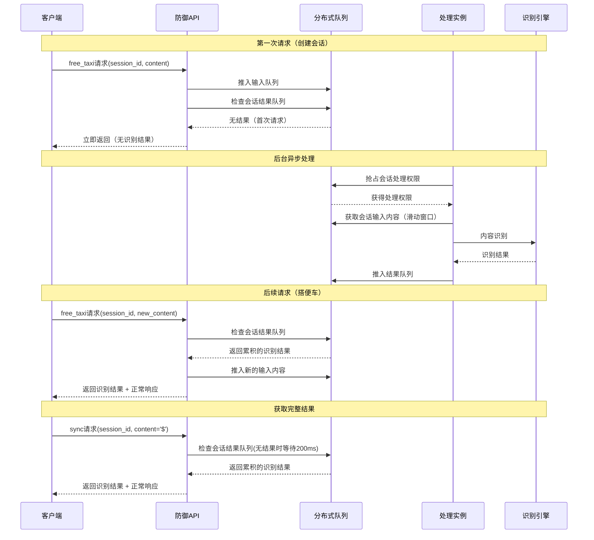
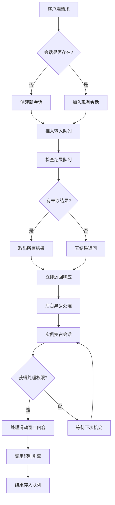
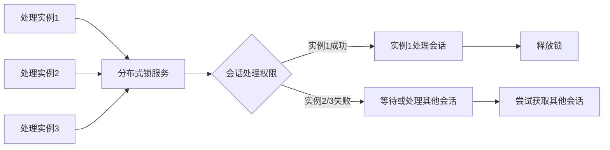

# 搭便车（free_taxi）异步内容识别方案

## 方案概述

搭便车方案是一种创新的大模型流式输出内容识别解决方案，旨在解决传统同步识别模式下的性能瓶颈和内容安全风险问题。该方案采用异步处理架构，通过"搭便车"的方式充分利用网络等待时间，实现高效的内容识别。

## 核心问题

### 1. 性能问题
- **识别耗时**：传统方案中，内容识别需要等待完整的文本生成，增加用户等待时间
- **网络延迟**：同步调用导致额外的往返时间（RTT）

### 2. 内容安全风险
- **恶意内容暴露**：在识别完成前，用户可能已经看到不当内容
- **响应延迟**：安全检查与内容展示之间的时间差

## 方案架构

### 系统组件

```
┌─────────────────┐    ┌─────────────────┐    ┌─────────────────┐
│   客户端应用      │    │   防御API网关    │    │   异步处理集群    │
│                 │    │                 │    │                 │
│ ┌─────────────┐ │    │ ┌─────────────┐ │    │ ┌─────────────┐ │
│ │业务逻辑层     │ │    │ │请求路由层   │ │    │ │队列管理器   │ │
│ └─────────────┘ │    │ └─────────────┘ │    │ └─────────────┘ │
│ ┌─────────────┐ │    │ ┌─────────────┐ │    │ ┌─────────────┐ │
│ │流式输出层     │ │    │ │结果缓存层   │ │    │ │识别引擎池   │ │
│ └─────────────┘ │    │ └─────────────┘ │    │ └─────────────┘ │
└─────────────────┘    └─────────────────┘    └─────────────────┘
         │                       │                       │
         └───────────────────────┼───────────────────────┘
                                 │
                    ┌─────────────────┐
                    │   分布式队列      │
                    │                 │
                    │ ┌─────────────┐ │
                    │ │输入队列       │ │
                    │ │会话队列       │ │
                    │ │结果队列       │ │
                    │ └─────────────┘ │
                    └─────────────────┘
```

## 核心流程

### 1. 请求处理流程



### 2. 会话管理机制



## 关键特性

### 1. 滑动窗口机制

```
会话输入队列（滑动窗口）：
┌─────────────────────────────────────────────────────┐
│ [内容1] [内容2] [内容3] [内容4] [内容5] [内容6] ...  │
│  ↑                                           ↑    │
│ 窗口起点                                    最新内容 │
│ (窗口大小可配置，如最近1000字符)                  │
└─────────────────────────────────────────────────────┘
```

- **窗口大小**：对应流式调用的次数
- **滑动机制**：新内容进入，旧内容移出
- **识别范围**：对窗口内内容进行识别

### 2. 分布式锁机制




## 技术优势

### 1. 性能优化
- **零等待**：API调用立即返回，不阻塞业务流程
- **批量处理**：一次识别多个内容片段，提高效率
- **资源复用**：识别引擎按需启动，避免空闲浪费

### 2. 安全增强
- **实时防护**：内容生成过程中持续监控
- **累积识别**：基于可配置的上下文窗口进行判断，灵活性更高
- **快速响应**：识别结果可立即应用于后续请求

### 3. 系统可靠性
- **容错机制**：处理实例故障不影响整体服务
- **负载均衡**：分布式处理，自动负载分配
- **数据一致性**：基于会话的状态管理


## 总结

搭便车方案通过创新的异步处理架构，有效解决了大模型流式输出中的内容识别挑战。该方案不仅显著提升了系统性能，还增强了内容安全防护能力，为现代AI应用提供了可靠的安全保障。